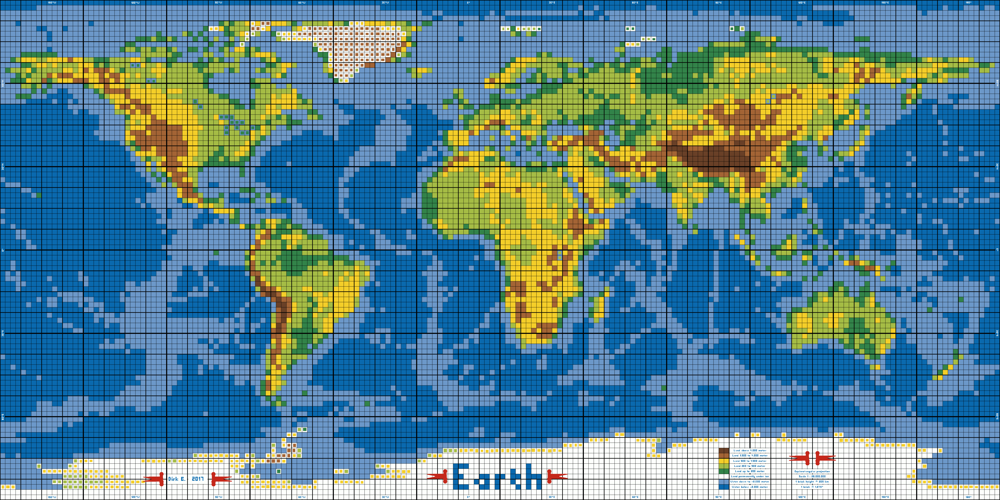

<head>
<STYLE TYPE="text/css">
<!--
p, ul { 
   color: grey85; 
   font-family: Georgia, serif; 
   font-size: 16px; 
   line-height: 28px;
   margin: 10px 10px 10px; 
   text-indent:  50px;
 }
--->
</STYLE>
</head>

  Dirk had a wondelfull idea, to build from scratch a <a href="https://dirks-blog.tumblr.com/LEGO-world-map">world map out of LEGO</a> (<a href="https://www.flickr.com/photos/dirkb86/35962608590/in/album-72157683748271032/">large image</a>). Shout out to **Dirk**!
  

  
  I love LEGO, and I love maps even more!
  
  I became obsessed with this ideia. Sure, who woulndt?! The problem is the high cost of the endevour... I started looking for a cheaper way from China, but could´t find a good source. 
  
  Then my third love come to me and said: look at me! I taking about data visualization, in the generic form of R, and in the specific form of a packadge called **<a href="https://github.com/tylermorganwall/rayshader">Rayshader</a>**. Shout out to **Tyler Morgan-Wall**!
  
  The ideia is simple, to construct my version of this LEGO map in R. It´s fun, not the same fun, but fun nonetheless.
  
  Than before starting I thought, if I am going to do it, let´s do it in the form of a walkthrough, so other people could use this as a guide to repeat the process, or as an introduction to Rayshader. I tried to be as expliced (or verbose) as I could on what I was doing.
  
  The walkthrough is divided in several parts. First we lear how load and read an .png image in order to colect the colors of the map. Then we manipulate the data in order to make a similar map in R. Theardly we use the functions of rayshader extensively, trying to understand how it works. And finally we apply rayshader in our map, and make a complex gif of the first voyage of Columbus to America. 
  
  I wanted to a make something that one could learn something, the goal of data visualization. 

# Image into R

## Load some packages

```{r setup, include=TRUE, message=FALSE, warning=FALSE, eval=TRUE, echo=TRUE}
# install.packages('png') 
# install.packages('ggplot2') 
# install.packages('viridis')
# install.packages("scales")
# install.packages("magick")
# install.packages("devtools")
# devtools::install_github("tylermorganwall/rayshader")
library(png) # image handler
library(ggplot2) # for graphs
library(tidyr) # data wangler
library(viridis) # for color pallete
library(scales) # scales
library(magick) # making gif
library(rayshader) # for all the fun
```

## Load the image

  The image was croped in <a href="http://www.online-image-editor.com/"> this online image editor</a>.
  
  Use the function *readPNG()* of the *png* package.

```{r , include=TRUE, message=FALSE, warning=FALSE, eval=TRUE, echo=TRUE}
#read image
img <- png::readPNG('C:\\Users\\ArthurWelle\\Desktop\\LEGO WORLD MAP\\mapa LEGO 50 X 50.png')
```

 By simple manipulation, on *MS Paint* I know that all the squares are 50 X 50 pixels each. That includes a black line that could take 1 pixel, 3 pixels or more (in order to make a nice grid). If the grid is wider, the square is shorter, but the metrics stays the same, 50px X 50px in total. That´s all we need to know, we just need to take the color of the central point of every square.
 
 If you're reading a PNG image with alpha channel, then each of the pixel variables is a vector with four entries, each entry corresponding to **Red**, **Green**, **Blue** and **Alpha** values of the pixel. With no Alpha just the three first colors.
 
```{r , include=TRUE, message=FALSE, warning=FALSE, eval=TRUE, echo=TRUE}
# color of fist pixel
color.top.left <- img[1,1,]     # row 1, column 1
```

```{r , include=TRUE, message=FALSE, warning=FALSE, eval=TRUE, echo=TRUE}
#color of center of fist square
color.center.first.square <- img[25,25,]  # row 25, column 25
color.center.first.square
```

  Now, note that the numbers are diffent of the patterns RGB that we know (<a href="https://www.w3schools.com/colors/colors_picker.asp">in here</a>). That´s because we have a continuum from 0 to 1 representing the more common 1 to 256. If we simple multiply 256 using our numbers above, we have the result we are looking for.

```{r , include=TRUE, message=FALSE, warning=FALSE, eval=TRUE, echo=TRUE}
#multiply to conquer!
color.center.first.square<-256*color.center.first.square

#round up and call
color.center.first.square<-trunc(color.center.first.square, 0)
color.center.first.square
```
  Cool. Just to be sure that the colors are exactly the same throughout, let´s visit the secound square that we know are supose to be the same color as the first.
  
```{r , include=TRUE, message=FALSE, warning=FALSE, eval=TRUE, echo=TRUE}
#color of center of fist square
color.center.secound.square <- img[25,75,]  # row 25, column 75
color.center.secound.square<-trunc(256*color.center.secound.square) # RGB number and round it
color.center.secound.square
```

  Nice! It´s working and the colors are consistent with each other.
  
# From image to values

  Let´s, than, populate a matrix with the color of every square.
  
  The work of Dirk created the following ranges:
  
  * Dark Green  = land up to 200 meters
  * Light Green = land from 200 to 500 meters
  * Yellow      = land from 500 to 1500 meters
  * Light Brown = land from 1500 to 4000 meters
  * Dark Brown  = land above 4000 meters
  
  * Light Blue  = water down to 2000 meters  
  * Dark Blue   = water bellow 2000 meters
  
  * white       = land permanently under ice
 
 Let´s take Alaska and South America as examples for simplicity.
 
 Alaska:
 
{ width=75% }

 South America:
 
{ width=75% }

  The Alaska bit above starts at square (9, 1), that is, counting from the top left, 9 squares down, 1 square to the right. The South America bit starts at (56, 48). Both of them have width of 20 squares and hight of 16 squares. 
  
  So, to get the center pixel of a square, we need to multiply its number/position for 50px, and add a margin (25px).
 
```{r , include=TRUE, message=FALSE, warning=FALSE, eval=TRUE, echo=TRUE}
#create the matrix
chile.matrix<-matrix(data = NA, nrow = 16, ncol = 20)

# populate a matrix
for (i in 0:(nrow(chile.matrix))) { #iterates rows
    for (j in 0:(ncol(chile.matrix))) { #iterates columns
        chile.matrix[i,j] <- paste((trunc(256*(img[(i*50+25 +(51*50) ),(j*50+25+(43*50) ),]))[1]) , #R
                                   (trunc(256*(img[(i*50+25 +(51*50) ),(j*50+25+(43*50) ),]))[2]) , #G
                                   (trunc(256*(img[(i*50+25 +(51*50) ),(j*50+25+(43*50) ),]))[3]) , #B
                                   sep="" )
    }
}
#chile.matrix[]
```
  
  Sorry for the cumbersome code and output. For debuging purposes I concatenate (*paste()*) the three colors in one string. My first thought was to use just one of the three as a marker, but than I feared that more than one point would have the same red property. 
  
  Let´s show every color:
  
```{r , include=TRUE, message=FALSE, warning=FALSE, eval=TRUE, echo=TRUE}
DarkBlue <-chile.matrix[1,1]
LightBlue <-chile.matrix[1,4]
LightGreen <-chile.matrix[1,7]
DarkGreen <-chile.matrix[1,12]
Yellow <-chile.matrix[2,7]
LightBrown <-chile.matrix[1,6]
DarkBrown <-chile.matrix[2,6]
```
  
  * Light Blue  = `r LightBlue`
  * Dark Blue   = `r DarkBlue`
  * Dark Green  = `r DarkGreen`
  * Light Green = `r LightGreen`
  * Yellow      = `r Yellow`
  * Light Brown = `r LightBrown`
  * Dark Brown  = `r DarkBrown`

## Giving the colors a value

  Let´s substitute the RGB colors for single values, since LEGOs are discrete. 
  
  We arrive in a moment of decision, we could put values similar to the actual world height, as the legend sugests, or we can put LEGO heights, that is discrete and incremental values, so that when rayshader do its work color represent height not height represents heights. Well, that was a confusing and correct sentence! This is a LEGO world, the choice is obvious.
  
```{r , include=TRUE, message=FALSE, warning=FALSE, eval=TRUE, echo=TRUE}
# colors become numbers
chile.matrix[chile.matrix=="10105174"] <- 1
chile.matrix[chile.matrix=="108152201"] <- 2
chile.matrix[chile.matrix=="16518869"] <- 3
chile.matrix[chile.matrix=="5013173"] <- 4
chile.matrix[chile.matrix=="24420641"] <- 5
chile.matrix[chile.matrix=="16310053"] <- 6
chile.matrix[chile.matrix=="1056439"] <- 7
chile.matrix
```
  
## Ploting by color(**ggplot2**)

  Ok, now we should be able to create the plot, using **ggplot2** (good reference guide <a href="http://r-statistics.co/Complete-Ggplot2-Tutorial-Part1-With-R-Code.html">here</a>). We just need a few tweaks in the data structure. We use some functions from tidyverse (fell free to go look it up if you need, I recomend <a href="https://www.rstudio.com/wp-content/uploads/2015/02/data-wrangling-cheatsheet.pdf">this</a>).
  
  We use the **viridis** package to make the first color scale, because I like it (the default works fine, and we are going to drop viridis soon). 
  
```{r , include=TRUE, message=FALSE, warning=FALSE, eval=TRUE, echo=TRUE}
#transform the matrix in a dataframe... why didnt you started with that in the first place?
d <- as.data.frame(chile.matrix)

#add a column with row names
d$Row <- c(paste(rep("R",16),1:16, sep=""))

# reshape the dataframe, from wide to long format (easyer for ggplot to handle)
d <- tidyr::gather(d, "Hight", "Value", 1:20)

# set the value as numeric, it were factors
d$Value <- as.numeric(d$Value)

#create graph
g<- ggplot2::ggplot(d, aes(y = Row, x = Hight, fill = Value)) +
                     geom_tile()  +
                     scale_fill_viridis_c(option = "C") 
g
```

  Well, that didn´t came out all right... 
  
  *Ggplot2::geom_tile* organized the order of columns and rows with their names. And V10, not V2 follows V1. 
  
  Let´s re-do the names of columns and rows, stating in 10. 
  
  Another thing, the ggplot start from bottom up, so we have to rewrite the sequence of rows, mirroring it.
  
  Aditionaly, for aesthetics let´s define de borders between the tiles as black. 

```{r , include=TRUE, message=FALSE, warning=FALSE, eval=TRUE, echo=TRUE}
# transform to a dataframe
d <- as.data.frame(chile.matrix)

#names in the colums
colnames(d) <- c(paste(rep("V",20),10:29, sep=""))

#add a column with row names, now stating in 25 decreasing to 10
d$Row <- c(paste(rep("R",16),25:10, sep=""))
d <- tidyr::gather(d, "Hight", "Value", 1:20)
d$Value <- as.numeric(d$Value)

#create graph
g<- ggplot2::ggplot(d, aes(y = Row, x = Hight, fill = Value)) +
                    geom_tile(color = "black")  +
                    scale_fill_viridis_c(option = "C") 
g

```

  That´s more like it! 
  
  Let´s deal with the colors. We have to make a scale such that the continuum of numbers (hights) show as a discrete list of colors. Note that we have to stick to a continuum in the numbers, rayshader is going to use the values to make the z axis. We just have to change de colors instead. In other words we keep the scale continuos, but with a discrete feeling.
  
  I had to feedle around a bit to find how to do such a trick. The answer (<a href="https://stackoverflow.com/questions/10981324/ggplot2-heatmap-with-colors-for-ranged-values">here</a>) comes with the functions **scale_fill_gradientn** and <a href="https://www.rdocumentation.org/packages/scales/versions/0.4.1/topics/rescale">**rescale**</a>. Combining the two I can set intervals for my continuos/discrete color scale.
  
  So we are coming back to the colors we got from the image (this time as <a href="https://www.rapidtables.com/web/color/RGB_Color.html">hex code</a>). That is the circle of life.

```{r , include=TRUE, message=FALSE, warning=FALSE, eval=TRUE, echo=TRUE}
#add a column with row names, now stating in 11
g<- ggplot2::ggplot(d, aes(y = Row, x = Hight, fill = Value)) +
                    geom_tile(color = "black")  +
                    scale_fill_gradientn(colours=c(
                      "#6C98C9",
                      "#0A69AE",
                      "#328349", 
                      "#A5BC45",
                      "#F4CE29",
                      "#A36435",
                      "#694027"),
                       values=rescale(c(1,2,3,4,5,6,7)),
                       guide="colorbar")
g
```

  This is going great! 
  
  Should we try the full world?

```{r , include=TRUE, message=FALSE, warning=FALSE, eval=TRUE, echo=TRUE, fig.height = 4.41, fig.width = 10}
#create the matrix for the whole map
world.matrix<-matrix(data = NA, nrow = 84, ncol = 192)

# populate a matrix
for (i in 0:(nrow(world.matrix)-1)) { #iterates rows
    for (j in 0:(ncol(world.matrix)-1)) { #iterates columns
        world.matrix[i,j] <- paste((trunc(256*(img[(i*50+25 ),(j*50+25 ),]))[1]) , #R
                                   (trunc(256*(img[(i*50+25 ),(j*50+25 ),]))[2]) , #G
                                   (trunc(256*(img[(i*50+25 ),(j*50+25 ),]))[3]) , #B
                                   sep="" )
    }
}

# colors become numbers
world.matrix[world.matrix=="10105174"] <- 1 # for light blue
world.matrix[world.matrix=="108152201"] <- 2 # for dark blue
world.matrix[world.matrix=="5013173"] <- 3 # for light greeb
world.matrix[world.matrix=="253256252"] <- 3 # for white, for now, white would be light green
world.matrix[world.matrix=="16518869"] <- 4 # for dark green
world.matrix[world.matrix=="24420641"] <- 5 # yellow
world.matrix[world.matrix=="16310053"] <- 6 # blow light
world.matrix[world.matrix=="1056439"] <- 7 # brown

# tranform in a data frame, and take last row line and last column line out (they were gray... I dont know, lol). 
d <- as.data.frame(world.matrix[1:83,1:191])

#names in the colums
colnames(d) <- c(paste(rep("V",190),100:289, sep=""))

#add a column with row names, now stating in 11
d$Row <- c(paste(rep("R",83),182:100, sep=""))

# gather
d <- tidyr::gather(d, "Hight", "Value", 1:191)
d$Value <- as.numeric(d$Value)

#create graph
g<- ggplot2::ggplot(d, aes(y = Row, x = Hight, fill = Value)) +
                    geom_tile(color = "gray")  +
                    coord_equal() + # set each tile to be squared, not rectangular
                    labs(x=NULL, y=NULL)+ # take out the axis legends
                    scale_fill_gradientn(colours=c(
                      "#6C98C9", 
                      "#0A69AE",
                      "#A5BC45", 
                      "#328349",
                      "#F4CE29", 
                      "#A36435",
                      "#694027"),
                       values=rescale(c(1,2,3,4,5,6,7)),
                       guide="colorbar") 

# Theme, margins manually edited
g1<- g + theme(    
              axis.ticks=element_blank(), 
              axis.text.x=element_blank(), 
              axis.text.y=element_blank(), 
              axis.title.x=element_blank(), 
              axis.title.y=element_blank(),
              plot.margin = unit(c(0, 0, 0, 0), "cm"), 
              legend.position = 'none') 
g1
```

  It's a win! 
  
  So, a couple of explanations. 
  
  I had to look it up how to manually get rid of most of the margins and other features of ggplot in this graph (*g + theme* above). There are some white tiles in the map. On the certer of some of them there is a smaller tile with the color of the altitute (I use this, as I take from each square que color of the central pixel). Still there are some white tiles that dont have this features, so I decided to set white as light green (**world.matrix[world.matrix=="253256252"] <- 3**). 
  
  Lastly, ggplot2 canvas size is given in the machine output. So I tweak it in the Rmakdown-chunk-options until I got the size that I wanted (**fig.height = 4.41, fig.width = 10**), with almost no white border.

# Rayshading the stuff

## Shading LEGO

  Now for the cool part. The function of Rayshader **plot_gg** uses a ggplot object and make it 3d. In our case, a geom_tile, it uses the value used to make the color of the tile to expand it in the z axis. I put the same width and height as the canvas done previosly, in order to get less white stuff (but it aint perfect yet).
 
```{r , include=TRUE, message=FALSE, warning=FALSE, eval=TRUE, echo=TRUE}
#experiment ray
rayshader::plot_gg(g1, width = 10, height = 4.41, scale = 30, multicore = TRUE, offset_edges=TRUE, windowsize = c(800, 800))

#save the snapshot (if you want it) (or without a name the output comes to Rmakdown).
rayshader::render_snapshot(clear = FALSE)
```

```{r , include=TRUE, message=FALSE, warning=FALSE, eval=TRUE, echo=TRUE, fig.height = 5, fig.width = 5}
#do one image, with a set of parameters
rayshader::render_camera(fov= 70, 
                         zoom = 0.1, 
                         theta = 58, 
                         phi = 18)

# take a picture
rayshader::render_snapshot(clear = FALSE)

```

```{r , include=TRUE, message=FALSE, warning=FALSE, eval=TRUE, echo=TRUE, fig.height = 5, fig.width = 5}
#one camera picture of the image above (focus)
rayshader::render_depth(focus = 0.72, 
                       focallength = 250)
```

  And voilà!! The coast of Africa, with North America as background.
  
  The function **rayshader::render_camera** makes an view point of the 3d image created above (in the *rayshader::plot_gg*) The parameters of this function are:
  
  * **theta**	 = Default '45'. Rotation angle.
  * **phi** = Default '45'. Azimuth angle. Maximum '90'.
  * **zoom** = Default '1'. Positive value indicating camera magnification.
  * **fov** = Default '0'. Field of view of the camera. Maximum '180'.
  
  After that we use the **rayshader::render_depth** function to make a camera photo of the point of view done in the *render_camera* above. This function has the following parameters (taken from the help):
  
  * **focus**	= Defaults '0.5'. Depth in which to blur. Minimum 0, maximum 1.
  * **focallength**	= Default '1'. Focal length of the virtual camera.
  * **fstop**	= Default '1'. F-stop of the virtual camera.
  * **filename**	= The filename of the image to be saved. If this is not given, the image will be plotted instead.
  * **bokehshape**	= Default 'circle'. Also built-in: 'hex'. The shape of the bokeh.
  * **bokehintensity**	= Default '3'. Intensity of the bokeh when the pixel intensity is greater than 'bokehlimit'.
  * **bokehlimit**	= Default '0.8'. Limit after which the bokeh intensity is increased by 'bokehintensity'.
  * **rotation**	= Default '0'. Number of degrees to rotate the hexagon bokeh shape.
  * **gamma_correction**	= Default 'TRUE'. Controls gamma correction when adding colors. Default exponent of 2.2.
  * **transparent_water**	= Default 'FALSE'. If 'TRUE', depth is determined without water layer. User will have to re-render the water layer with 'render_water()' if they want to recreate the water layer.
  * **progbar**	= Default 'TRUE' if in an interactive session. Displays a progress bar.
  * **clear**	= Default 'FALSE'. If 'TRUE', the current 'rgl' device will be cleared.
  
  I am no photograper and I don´t claim to have understand all these features, but I can apreciate the extend of the awesome work done here! Congratz Tyler!

## Let´s move the camera

  Now, with the function **rayshader::render_movie** we can movement the camera positon and attributes doing a movie (mp4, gif). We just play with the parameters phi, theta and zoom. We are going to make three lists for each of these parameters. Each list will have 390 point of view (they have to be the same length).
  
```{r , include=TRUE, message=FALSE, warning=FALSE, eval=TRUE, echo=TRUE}
#parameters for 360 positions
phivechalf = 30 + 60 * 1/(1 + exp(seq(-7, 20, length.out = 180)/2))
phivecfull = c(rep("88.2", 30), phivechalf, rev(phivechalf))
thetavec = c(rep("0", 30), 0 + 60 * sin(seq(0,359,length.out = 360) * pi/180))
zoomvec = 0.25 + 0.4 * 1/(1 + exp(seq(-5, 20, length.out = 180)))
zoomvecfull = c(rep("0.65", 30),zoomvec, rev(zoomvec))
```

In order to better undestand what is going on, I like to plot these parameters. 

```{r , include=TRUE, message=FALSE, warning=FALSE, eval=TRUE, echo=TRUE}
#experiment ray
plot(phivecfull)
```

```{r , include=TRUE, message=FALSE, warning=FALSE, eval=TRUE, echo=TRUE}
#experiment ray
plot(thetavec)
```

```{r , include=TRUE, message=FALSE, warning=FALSE, eval=TRUE, echo=TRUE}
#experiment ray
plot(zoomvecfull)
```

  That gives me a sense from where the camera will be looking as the 360 frames progresses. We would like to have smooth transitions in this case, in another we could make cuts in the shot, from one place to the other, it´s up to you. I will save it as a MP4 video. I don´t think that I can embed a video in github pages, so the result is not show here.

```{r , include=TRUE, message=FALSE, warning=FALSE, eval=FALSE, echo=TRUE}
# do the dance
rayshader::render_movie(filename="MP4c",
             type='custom',
             frames = 390,  
             phi = phivecfull, 
             zoom = zoomvecfull, 
             theta = thetavec
             )
```

  Ok, done a video of this (but you have to try by yourself).

## Making a steady-cam gif, with focal change.

  We did make a photo of the 3d image with focal parameters. As I understook there is no focal parameters in the **render_movie type=custom**, so we are going to stitch togheder a bunch of still images in a gif. Let´s do another for loop. In this loop I will start at the 60 and go to 95, these are the *focus* (focuses, focusea?) that will be changing over time. 

```{r , include=TRUE, message=FALSE, warning=FALSE, eval=FALSE, echo=TRUE}
# saving a bunch of imagens with diferent focus
for (i in 60:95) { 
rayshader::render_camera(fov= 70, 
                         zoom = 0.1, 
                         theta = 58, 
                         phi = 18)

rayshader::render_depth(filename=paste("fig",i),
                        focus = i/100, 
                        focallength = 250)
}

```

  And now using **magick** package make a gif from images.

```{r , include=TRUE, message=FALSE, warning=FALSE, eval=FALSE, echo=TRUE}
#list of images, reversed and concatenated
frames <- paste0("fig ", 60:95, ".png")
#frames <-c(frames, rev(frames))

#do the magick
m <- magick::image_read(frames)
m <- magick::image_animate(m)

#save the gif
magick::image_write(m, "movie2.gif")
```


  I guess my wish came true (with some work)! I make myself a nice LEGO map (and github pages likes gifs). 

# Columbus Voyage in a virtual LEGO map.

  The only thing that´s left to do is to take things even further! Can we make a gif showing <a href="https://en.wikipedia.org/wiki/Voyages_of_Christopher_Columbus#/media/File:Viajes_de_colon_en.svg">Columbus first voyage</a> trough the Atlantic Ocean?
  
  That will require some work, and again some tricks. 
  
  Fist of all, to get another color in the same map, how do we go about it? Add another hight? Could be done, but it might be strange. I will interpolate every color/number with a red middle point. So every time we have a 1.5, or a 4.5 in the matrix representing the hights that point will be highlighted in red (with no detriment to the other colors). 
  
  Secondly, I need to make the path of the voyage, that is, painfully collecting the points in the map (thanks Ana!).
  
  I will also select only smaller quadrant to show this time.


```{r , include=TRUE, message=FALSE, warning=FALSE, eval=TRUE, echo=TRUE, fig.height = 6, fig.width = 6 } 
#create a copy of the data, with no missing, and just a part
d1<-na.omit(d)  %>% 
  dplyr::filter(Row %in% c( paste0("R", 125:175) ))%>%
  dplyr::filter(Hight %in% c( paste0("V", 144:195) ))


#create two verctos with the positions of the travel
lon<-c(  155,154,153,152,151,150,149,148,
         rep(148,31),
         147,147,147,147,147,146,146,146,146,
         147,148,149,150,151,152,153,154,155,156,157,
         rep(157,18))

lat<-c(  185,184,183,182,181,180,179,179,
         178:148,
         147,148,149,150,151,151,152,153,154,
         155,156,157,158,159,160,161,162,163,164,165,
         166:183)

#populate new data, with 0.5 plus in the path above
for (i in 1:(length(lon))) { 
  d1[ d1$Row==paste0("R",lon[i]) & d1$Hight==paste0("V",lat[i]) , ]$Value<-d1[ d1$Row==paste0("R",lon[i]) & d1$Hight==paste0("V",lat[i]) , ]$Value +0.5
}

# take 0.5 of one point that shows in the way in and in the way out
d1[ d1$Row=="R148" & d1$Hight=="V156" , ]$Value<-d1[ d1$Row=="R148" & d1$Hight=="V156" , ]$Value - 0.5

#create graph
g2<- ggplot2::ggplot(d1, aes(y = Row, x = Hight, fill = Value)) +
                    geom_tile(color = "gray")  +
                    coord_equal() + # set each tile to be squared, not rectangular
                    labs(x=NULL, y=NULL)+ # take out the axis legends
                    scale_fill_gradientn(colours=c(
                      "#6C98C9", 
                      "#ff0000", #rede
                      "#0A69AE",
                      "#ff0000", #red
                      "#A5BC45",
                      "#ff0000", #red
                      "#328349",
                      "#ff0000", #red
                      "#F4CE29", 
                      "#ff0000", #red
                      "#A36435",
                      "#ff0000", #red
                      "#694027"),
                      #"#ff0000"), #red for some reason could make 7.5, i wont need it
                       values=rescale(c(1,1.5, 2, 2.5, 3, 3.5, 4, 4.5, 5, 5.5, 6, 6.5, 7)),
                       guide="colorbar") 

# Theme, margins manually edited
g2<- g2 + theme(    
              axis.ticks=element_blank(), 
              axis.text.x=element_blank(), 
              axis.text.y=element_blank(), 
              axis.title.x=element_blank(), 
              axis.title.y=element_blank(),
              plot.margin = unit(c(0, 0, 0, 0), "cm"), 
              legend.position = 'none') 
g2
```

  Ok, now it's time to make one still-frame image of the voyage with rayshader. I will feadle around with the parameters to find good points of view. Then I will record they in my drive as .pngs. That´s a big *for loop*: construct a new ggplot with the position of Columbus, take the photo and start over. 
  
  Before the loop, we soon arrive at a problem. The point of view are a globe around the object. Say you want a photo of that object from other angle, like if you take a step to the side? You be out of the globe of points... So the work around is to change the center of the object, either construction more blanck space in some of the sides of the object or you can select a subset of the object to be displayed, this time center at the desired point. Let´s try both of the aproaches.
  
### A section of the map
  
```{r , include=TRUE, message=FALSE, warning=FALSE, eval=FALSE, echo=TRUE} 
# data without missing and selection only an area
d1<-na.omit(d)%>% 
  dplyr::filter(Row %in% c( paste0("R", 115:182) ))%>% # selection of rows
  dplyr::filter(Hight %in% c( paste0("V", 133:200) )) # selection of columns

# create graph
g2<- ggplot2::ggplot(d1, aes(y = Row, x = Hight, fill = Value)) +
                    geom_tile(color = "gray")  +
                    coord_equal() + # set each tile to be squared, not rectangular
                    labs(x=NULL, y=NULL)+ # take out the axis legends
                    scale_fill_gradientn(colours=c(
                      "#6C98C9", 
                      "#ff0000", #red
                      "#0A69AE",
                      "#ff0000", #red
                      "#A5BC45",
                      "#ff0000", #red
                      "#328349",
                      "#ff0000", #red
                      "#F4CE29", 
                      "#ff0000", #red
                      "#A36435",
                      "#ff0000", #red
                      "#694027"),
                      #"#ff0000"), #red for some reason could make 7.5, i wont need it
                       values=rescale(c(1,1.5, 2, 2.5, 3, 3.5, 4, 4.5, 5, 5.5, 6, 6.5, 7)),
                       guide="colorbar") 

# Theme, margins manually edited
g2<- g2 + theme(    
              axis.ticks=element_blank(), 
              axis.text.x=element_blank(), 
              axis.text.y=element_blank(), 
              axis.title.x=element_blank(), 
              axis.title.y=element_blank(),
              plot.margin = unit(c(0, 0, 0, 0), "cm"), 
              legend.position = 'none') 
g2
```

```{r , include=TRUE, message=FALSE, warning=FALSE, eval=TRUE, echo=TRUE, fig.height = 6, fig.width = 6} 
# ray
rayshader::plot_gg(g2, width = 6, height = 6, scale = 30, multicore = TRUE, offset_edges=TRUE, windowsize = c(800, 800))

#do one image, with a set of parameters
rayshader::render_camera(fov= 70, 
                         zoom = 0.1, 
                         theta = 100, 
                         phi = 18)

rayshader::render_depth(focus = 0.72, 
                       focallength = 250)
```

### Offset map

  With the offset map, we got the whole world but in expense to the squared-ness of the bricks being less sharp. I changed *plot.margin* values.

```{r , include=TRUE, message=FALSE, warning=FALSE, eval=TRUE, echo=TRUE, fig.height = 6, fig.width = 12}
# data without missing
d1<-na.omit(d)

# create graph
g2<- ggplot2::ggplot(d1, aes(y = Row, x = Hight, fill = Value)) +
                    geom_tile(color = "gray")  +
                    coord_equal() + # set each tile to be squared, not rectangular
                    labs(x=NULL, y=NULL)+ # take out the axis legends
                    scale_fill_gradientn(colours=c(
                      "#6C98C9", 
                      "#ff0000", #red
                      "#0A69AE",
                      "#ff0000", #red
                      "#A5BC45",
                      "#ff0000", #red
                      "#328349",
                      "#ff0000", #red
                      "#F4CE29", 
                      "#ff0000", #red
                      "#A36435",
                      "#ff0000", #red
                      "#694027"),
                      #"#ff0000"), #red for some reason could make 7.5, i wont need it
                       values=rescale(c(1,1.5, 2, 2.5, 3, 3.5, 4, 4.5, 5, 5.5, 6, 6.5, 7)),
                       guide="colorbar") 

# Theme, margins manually edited
g2<- g2 + theme(    
              axis.ticks=element_blank(), 
              axis.text.x=element_blank(), 
              axis.text.y=element_blank(), 
              axis.title.x=element_blank(), 
              axis.title.y=element_blank(),
              plot.margin = unit(c(0, 0, -2.5, 7.5), "cm"), #here add the space
              legend.position = 'none') 
g2
```

  A lot of white space...

```{r , include=TRUE, message=FALSE, warning=FALSE, eval=TRUE, echo=TRUE, fig.height = 6, fig.width = 6}
# ray
rayshader::plot_gg(g2, width = 12, height = 6, scale = 15, multicore = TRUE, offset_edges=TRUE, windowsize = c(800, 800))

#do one image, with a set of parameters
rayshader::render_camera(fov= 70, 
                         zoom = 0.05, 
                         theta = 100, 
                         phi = 18)

rayshader::render_depth(focus = 0.72, 
                       focallength = 250)
```

```{r , include=TRUE, message=FALSE, warning=FALSE, eval=TRUE, echo=TRUE, fig.height = 6, fig.width = 6}
#do one image, with a set of parameters
rayshader::render_camera(fov= 70, 
                         zoom = 0.06, 
                         theta = 285, 
                         phi = 12)

rayshader::render_depth(focus = 0.74, 
                       focallength = 250)
```

  I choose de first option, losing some of the map but maintained the sharpness of the tiles.

## The big for loop
  
  We have 77 positions of the boat. Let´s make 77 photos of the object then. We have to start playing with the point of view and construct lists (with 77 elements) for every parameter used. 
  
  Let´s plot five point of view: 
  
  * starting the jorney at the coast of Spain
  * coast of Africa 
  * arriving at America 
  * departure of central America
  * back home
  

```{r , include=TRUE, message=FALSE, warning=FALSE, eval=TRUE, echo=TRUE, fig.height = 4, fig.width = 4} 
# data without missing
d1<-na.omit(d)%>% 
  dplyr::filter(Row %in% c( paste0("R", 115:182) ))%>% # selection of rows
  dplyr::filter(Hight %in% c( paste0("V", 133:200) )) # selection of columns

# one point of the trip
d1[ d1$Row==paste0("R",lon[i]) & d1$Hight==paste0("V",lat[i]) , ]$Value<-d1[ d1$Row==paste0("R",lon[i]) & d1$Hight==paste0("V",lat[i]) , ]$Value +0.5

# create graph
g2<- ggplot2::ggplot(d1, aes(y = Row, x = Hight, fill = Value)) +
                    geom_tile(color = "gray")  +
                    coord_equal() + # set each tile to be squared, not rectangular
                    labs(x=NULL, y=NULL)+ # take out the axis legends
                    scale_fill_gradientn(colours=c(
                      "#6C98C9", 
                      "#ff0000", #red
                      "#0A69AE",
                      "#ff0000", #red
                      "#A5BC45",
                      "#ff0000", #red
                      "#328349",
                      "#ff0000", #red
                      "#F4CE29", 
                      "#ff0000", #red
                      "#A36435",
                      "#ff0000", #red
                      "#694027"),
                      #"#ff0000"), #red for some reason coulnd make 7.5, I wont need it
                       values=rescale(c(1,1.5, 2, 2.5, 3, 3.5, 4, 4.5, 5, 5.5, 6, 6.5, 7)),
                       guide="colorbar") 

# Theme, margins manually edited
g2<- g2 + theme(    
              axis.ticks=element_blank(), 
              axis.text.x=element_blank(), 
              axis.text.y=element_blank(), 
              axis.title.x=element_blank(), 
              axis.title.y=element_blank(),
              plot.margin = unit(c(0, 0, 0, 0), "cm"), 
              legend.position = 'none') 

# ray
rayshader::plot_gg(g2, width = 6, height = 6, scale = 30, multicore = TRUE, offset_edges=TRUE, windowsize = c(800, 800))

#do one image, with a set of parameters
rayshader::render_camera(fov= 70, 
                         zoom = 0.12, 
                         theta = 100, 
                         phi = 18)

rayshader::render_depth(focus = 0.66, 
                       focallength = 250)
```

```{r , include=TRUE, message=FALSE, warning=FALSE, eval=TRUE, echo=TRUE, fig.height = 4, fig.width = 4} 
#do one image, with a set of parameters
rayshader::render_camera(fov= 70, 
                         zoom = 0.15, 
                         theta = 95, 
                         phi = 25)

rayshader::render_depth(focus = 0.71, 
                       focallength = 250)

```

  Arriving at land... 

```{r , include=TRUE, message=FALSE, warning=FALSE, eval=TRUE, echo=TRUE, fig.height = 4, fig.width = 4} 
#do one image, with a set of parameters
rayshader::render_camera(fov= 70, 
                         zoom = 0.09, 
                         theta =90, 
                         phi = 14)

rayshader::render_depth(focus = 0.88, 
                       focallength = 250)

```

  The return...

```{r , include=TRUE, message=FALSE, warning=FALSE, eval=TRUE, echo=TRUE, fig.height = 4, fig.width = 4} 
#do one image, with a set of parameters
rayshader::render_camera(fov= 70, 
                         zoom = 0.34, 
                         theta =285, 
                         phi = 33)

rayshader::render_depth(focus = 0.70, 
                       focallength = 250)

```
 
 End point of view

```{r , include=TRUE, message=FALSE, warning=FALSE, eval=TRUE, echo=TRUE, fig.height = 4, fig.width = 4} 
#do one image, with a set of parameters
rayshader::render_camera(fov= 70, 
                         zoom = 0.37, 
                         theta =340, 
                         phi = 57)

rayshader::render_depth(focus = 0.82, 
                       focallength = 250)

```
 
 Interpolate all the views.

```{r , include=TRUE, message=FALSE, warning=FALSE, eval=FALSE, echo=TRUE, fig.height = 6, fig.width = 6} 
#sequences of parameters (we already have lat lon for columbus position coming from the previos chunk)
List_fov <-         c(rep(70, 77))
List_zoom <-        c(seq(0.12, 0.12, length.out = 10), #10
                      seq(0.12, 0.09, length.out = 30), #20-40
                      seq(0.34, 0.37, length.out = 37)) #40-77
List_theta <-       c(seq(100, 95, length.out = 10), #10
                      seq(95, 90, length.out = 30), #40-77
                      seq(285, 340, length.out = 37)) #40-77
List_phi <-         c(seq(18, 25, length.out = 10), #10
                      seq(25, 14, length.out = 30), #20-40
                      seq(33, 57, length.out = 37)) #40-77
List_focus <-       c(seq(0.66, 0.71, length.out = 10), #10
                      seq(0.71, 0.88, length.out = 30), #20-40
                      seq(0.71, 0.74, length.out = 10), #40-50
                      seq(0.74, 0.81, length.out = 10), #50-60
                      seq(0.81, 0.82, length.out = 17)) #60-77
List_focallength <- c(rep(250, 77))

# data without missing, selected
d1<-na.omit(d)%>% 
  dplyr::filter(Row %in% c( paste0("R", 115:182) ))%>% # selection of rows
  dplyr::filter(Hight %in% c( paste0("V", 133:200) )) # selection of columns

# start the loop
for (i in 50:77) { 

# one point of the trip
d1[ d1$Row==paste0("R",lon[i]) & d1$Hight==paste0("V",lat[i]) , ]$Value<-d1[ d1$Row==paste0("R",lon[i]) & d1$Hight==paste0("V",lat[i]) , ]$Value +0.5

# create graph
g2<- ggplot2::ggplot(d1, aes(y = Row, x = Hight, fill = Value)) +
                    geom_tile(color = "gray")  +
                    coord_equal() + # set each tile to be squared, not rectangular
                    labs(x=NULL, y=NULL)+ # take out the axis legends
                    scale_fill_gradientn(colours=c(
                      "#6C98C9", 
                      "#ff0000", #red
                      "#0A69AE",
                      "#ff0000", #red
                      "#A5BC45",
                      "#ff0000", #red
                      "#328349",
                      "#ff0000", #red
                      "#F4CE29", 
                      "#ff0000", #red
                      "#A36435",
                      "#ff0000", #red
                      "#694027"),
                      #"#ff0000"), #red for some reason coulnd make 7.5, I wont need it
                       values=rescale(c(1,1.5, 2, 2.5, 3, 3.5, 4, 4.5, 5, 5.5, 6, 6.5, 7)),
                       guide="colorbar") 

# Theme, margins manually edited
g2<- g2 + theme(    
              axis.ticks=element_blank(), 
              axis.text.x=element_blank(), 
              axis.text.y=element_blank(), 
              axis.title.x=element_blank(), 
              axis.title.y=element_blank(),
              plot.margin = unit(c(0, 0, 0, 0), "cm"), 
              legend.position = 'none') 

# ray
rayshader::plot_gg(g2, width = 6, height = 6, scale = 30, multicore = TRUE, offset_edges=TRUE, windowsize = c(800, 800))

# make a point of view
rayshader::render_camera(fov= List_fov[i], 
                         zoom = List_zoom[i], 
                         theta = List_theta[i], 
                         phi = List_phi[i])

#save a picture
rayshader::render_depth(filename=paste0("Pic",i),
                        focus = List_focus[i], 
                        focallength = List_focallength[i],
                        clear = TRUE)

# one point out of the trip
d1[ d1$Row==paste0("R",lon[i]) & d1$Hight==paste0("V",lat[i]) , ]$Value<-d1[ d1$Row==paste0("R",lon[i]) & d1$Hight==paste0("V",lat[i]) , ]$Value - (0.5)
}

```

### A little map on the top of the gif.

```{r , include=TRUE, message=FALSE, warning=FALSE, eval=TRUE, echo=TRUE} 
#

```

### All the images together on a gif

  Let´s make some text to be put together on the gif, the date of the voyage. Additionally let´s put my twitter handle on the bottom of the gif. 
  
```{r , include=TRUE, message=FALSE, warning=FALSE, eval=TRUE, echo=TRUE} 
#

```

  All together now!

```{r , include=TRUE, message=FALSE, warning=FALSE, eval=FALSE, echo=TRUE}
#list of images, reversed and concatenated
frames <- paste0("Pic", 1:10, ".png")
#frames <-c(frames, rev(frames))

#do the magick!
m <- magick::image_read(frames)
m <- magick::image_animate(m, fps = 1)

#save the gif
magick::image_write(m, "Columbus.gif")
```

  
  
  Finish! That´s my take on this issue. Turns out to be a longer take than I expected. 
  
  I hope you enjoy the ride/sail as well. There is of course things that can be done better. One that bottered me a bit was the lack of function using/making. Repeating the code when it´s not necessary is a bad practice, but I keep it that way so it would be clearer for any user what's going on in every part of the code (I could pin point some of code lines that lack clarity! Sorry.). 
  
  I learned a lot doing this little side project. Greatest shout out to the guys that did the real base work, **Tyler Morgan-Wall** and **Dirk**.
  
  I supose I must cite here in the end **brickr**, which is a package for bulding LEGO bricks in R. I had never tried the package, but I am sure, it´s quite fun as well. Give it a go!
  
  
  
  

